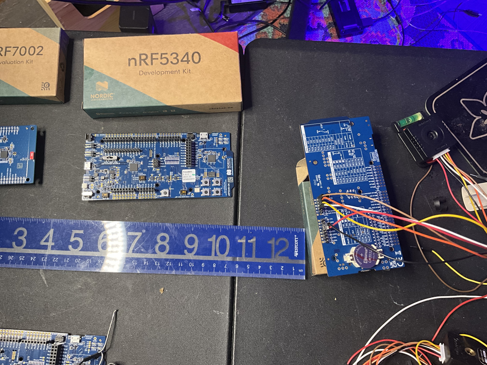
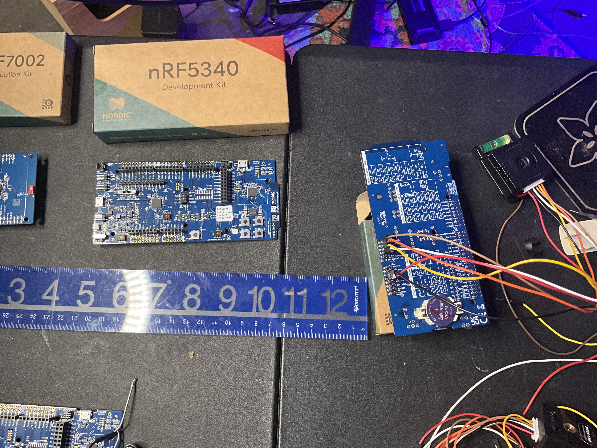
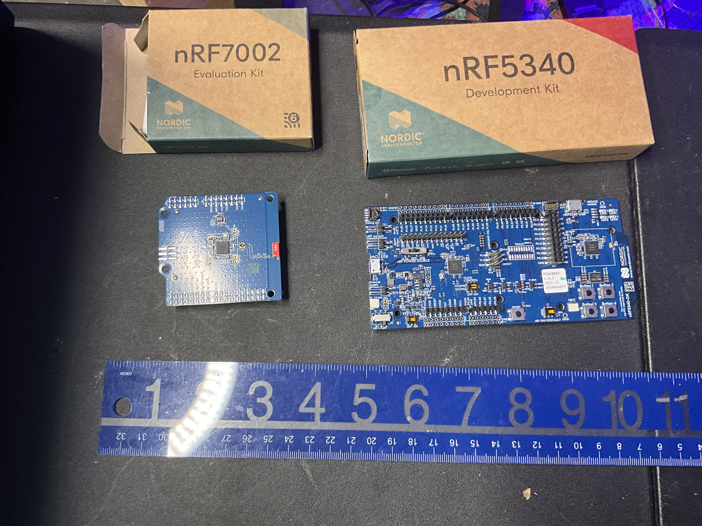
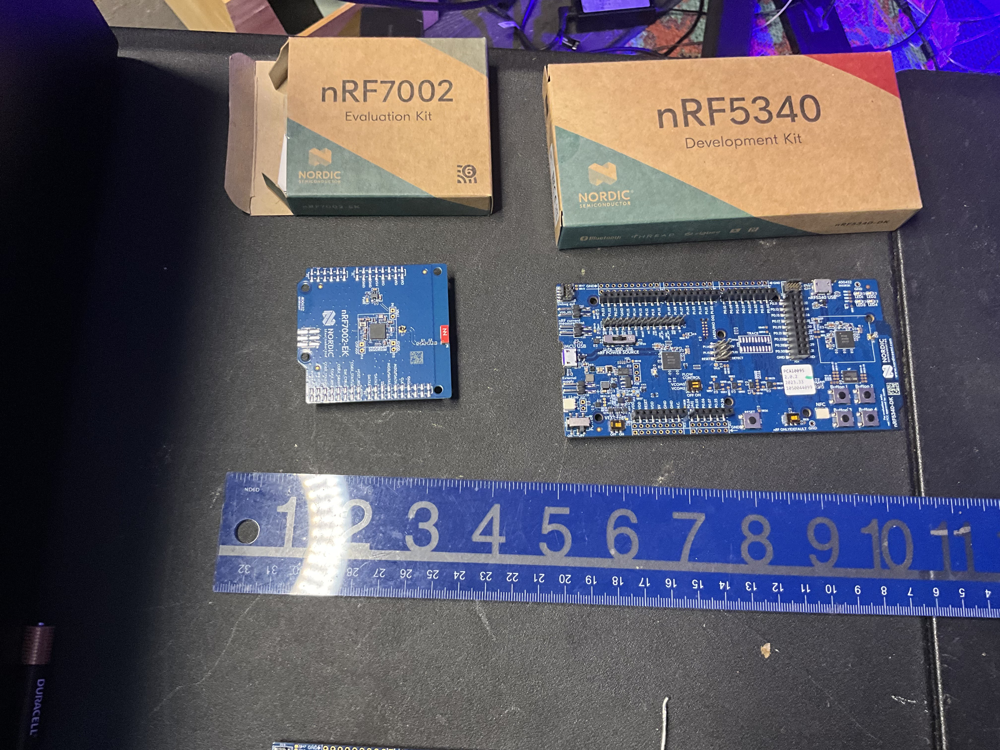
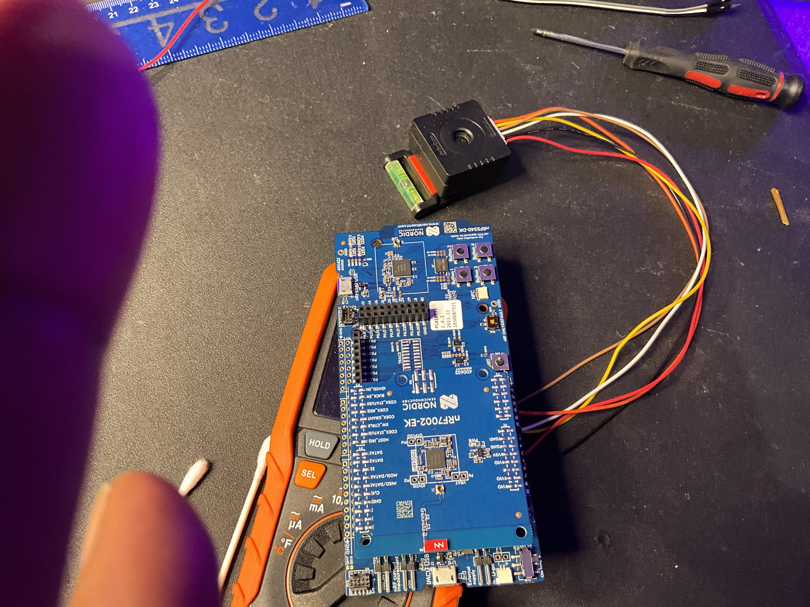

# ArduCAM NORD Zephyr Module for nRF5340 + 7002 EK Shield

This Zephyr/NCS module provides **support for the ArduCAM Mega SPI camera** on the nRF5340, including a minimal capture demo and BLE/Wi-Fi integration. It is designed to work with the **nRF5340 Development Kit** and **nRF7002 Wi-Fi/BLE shield**.

---

## Features

* Manual CS GPIO for **precise SPI timing**
* Minimal capture demo that:

  * Triggers an image capture
  * Polls until capture is complete
  * Reads FIFO length of captured image
  * Logs first 16 bytes (JPEG header expected)
* Wi-Fi + BLE image transfer capability
* Supports **camera controls**: resolution, brightness, contrast, saturation, exposure, white balance, special effects, sharpness, manual gain/exposure, low-power mode
* Compatible with **off-tree NCS integration**
* Flexible **SPI/I²C/pin configuration**

---

## Hardware Images

| Image                                         | Description                                   |
| --------------------------------------------- | --------------------------------------------- |
|  | nRF7002 EK Shield next to its box             |
|  | nRF5340 DK beside its box                     |
|    | Physical scale reference with ruler           |
|     | Backside showing custom header for SPI access |
|            |                                               |

